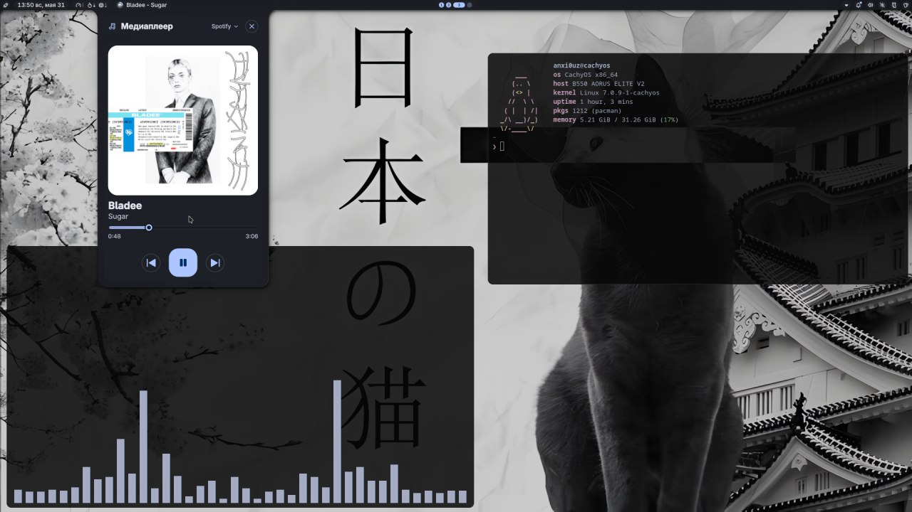
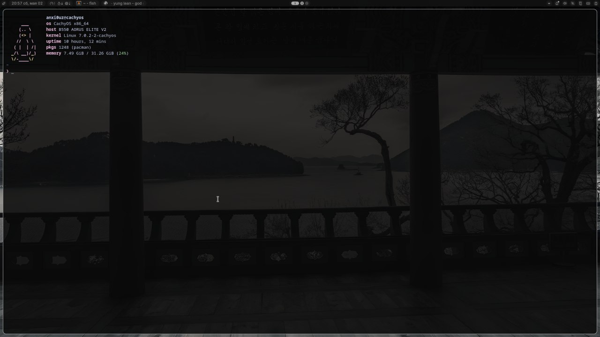
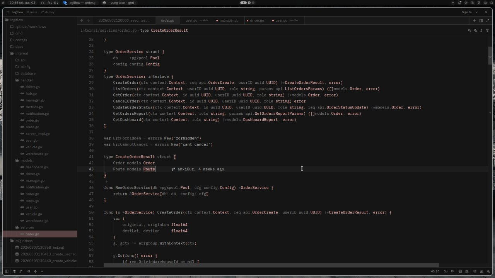

# dotfiles

My personal dotfiles for a [CachyOS](https://cachyos.org/) setup running the [niri](https://github.com/YaLTeR/niri) Wayland compositor.

## Screenshots







## Setup

| Component        | Tool                                               |
| ---------------- | -------------------------------------------------- |
| OS               | CachyOS x86_64                                     |
| Kernel           | Linux 7.0.2-2-cachyos                              |
| WM               | [niri](https://github.com/YaLTeR/niri)             |
| Shell            | [noctalia-shell](https://github.com/noctalia-dev/noctalia-shell) (via quickshell) |
| Terminal         | [Alacritty](https://alacritty.org/)                |
| CLI Shell        | [fish](https://fishshell.com/)                     |
| Clipboard UI     | [fuzzel](https://codeberg.org/dnkl/fuzzel) + [cliphist](https://github.com/sentriz/cliphist) |
| Fetch            | [fastfetch](https://github.com/fastfetch-cli/fastfetch) |

## Structure

```
dotfiles/
├── alacritty/      # Terminal config
├── fastfetch/      # Fetch tool config
├── fish/           # Shell config
├── fuzzel/         # Clipboard UI config
├── niri/           # Window manager config
├── noctalia.json   # Bar config
└── images/         # Screenshots
```

## Installation

Clone the repo and symlink configs to their respective locations:

```sh
git clone https://github.com/anxi0uz/dotfiles ~/.dotfiles
```

Then symlink individual configs as needed, for example:

```sh
ln -s ~/.dotfiles/alacritty ~/.config/alacritty
ln -s ~/.dotfiles/fish ~/.config/fish
ln -s ~/.dotfiles/niri ~/.config/niri
ln -s ~/.dotfiles/fuzzel ~/.config/fuzzel
ln -s ~/.dotfiles/fastfetch ~/.config/fastfetch
```
